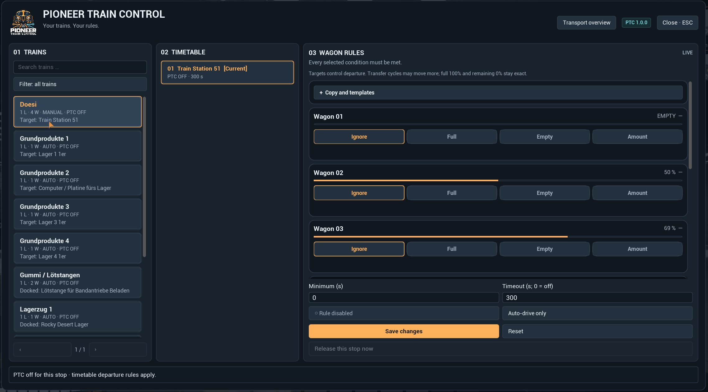
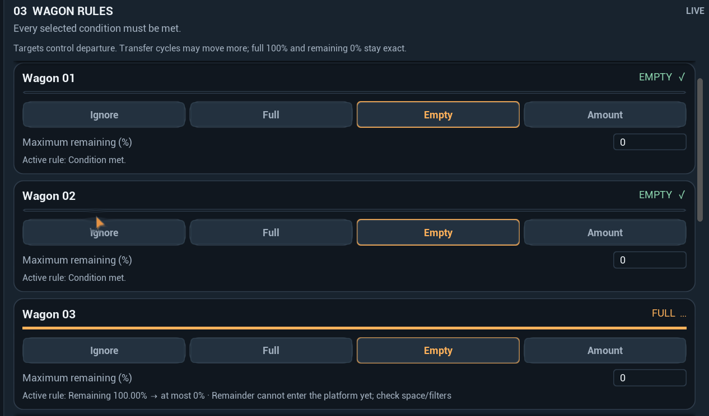
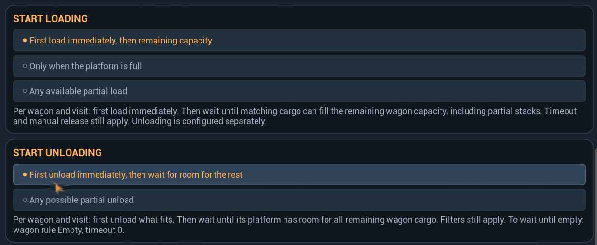
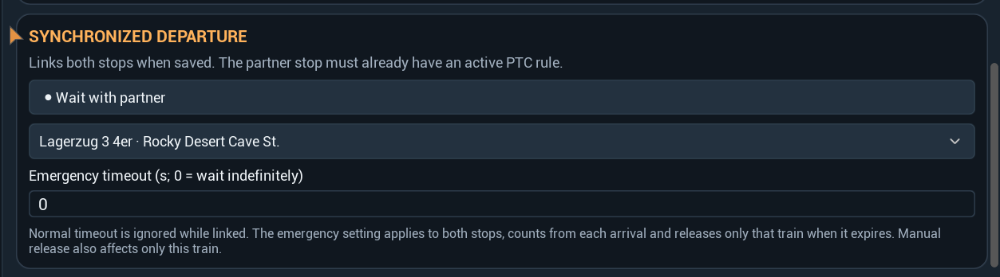
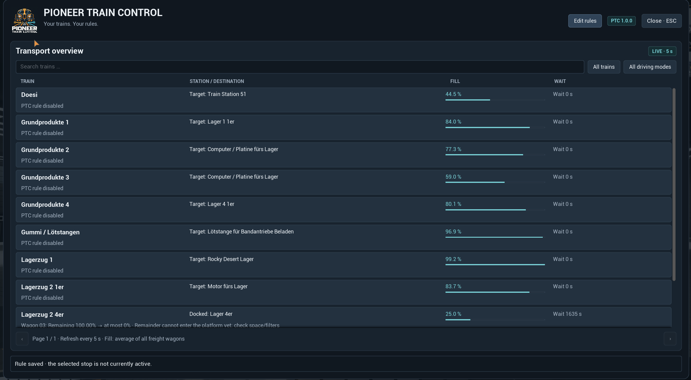

# Pioneer Train Control 1.0.0

**Deine Züge. Deine Regeln.**

Individuelle Abfahrtsbedingungen pro Waggon, gemeinsame Abfahrten und eine aktuelle Transportübersicht für **Satisfactory**.

[English](README.md) · [Schnellstart](#schnellstart) · [Problem melden](https://github.com/DerDoesewicht/PioneerTrainControl/issues)

*Die Spielaufnahmen zeigen Teststand r30. Version 1.0.0 enthält das grafische Redesign und das neue Logo im Menükopf.*

> **1.0.0 · Beta.** Ein verbleibender Ladefehler kann dazu führen, dass ein Waggon nach einem Nachladeversuch sein Ziel nicht erreicht. Beachte die [bekannten Einschränkungen](#bekannte-einschränkungen), wenn du vollständige Beladung verlangst.

## Jeder Waggon erhält seine eigene Regel

Lege für jeden Fahrplanhalt fest, welche Frachtwaggons beladen oder entladen sein müssen. Ein Waggon kann auf neue Ware warten, während ein anderer leer werden soll. Alle ausgewählten Bedingungen müssen für die normale PTC-Freigabe gemeinsam erfüllt sein.

| Waggonmodus | Abfahrtsbedingung | Beispiel |
| --- | --- | --- |
| **Ignorieren** | Dieser Waggon trägt keine Bedingung bei. | Ein Waggon für einen anderen Halt. |
| **Voll** | Mindestfüllstand von 1–100% erreichen. 100% verlangt vollständige Beladung. | Abfahrt ab 70% Füllstand. |
| **Leer** | Höchstens 0–100% Restfüllstand behalten. 0% verlangt einen leeren Waggon. | Abfahrt mit maximal 10% Rest. |
| **Menge** | Mindestens die gewählte Stückzahl eines bestimmten Feststoffs enthalten. | Mindestens 2.000 Stahlträger. |

Das sind **Abfahrtsbedingungen**, keine Mengenbegrenzungen. Ein normaler Transferzyklus kann mehr übertragen als das eingestellte Ziel. Stückziele zählen nur den gewählten Feststoff; Prozentziele beziehen sich auf den Füllstand.

## Lade- und Entladebeginn festlegen

Abfahrtsziele und Transferbeginn sind getrennte Einstellungen.

| Lademodus | Verhalten |
| --- | --- |
| **Erste Ladung sofort, danach Restmenge** | Die erste Ladung beginnt direkt. Weitere Zyklen warten auf genug passende Ware für den verbleibenden Waggonplatz. |
| **Nur bei voller Plattform** | Jede Ladeplattform wartet vor einem Zyklus, bis ihr eigenes Inventar voll ist. |
| **Jede verfügbare Teilmenge** | Passende Teilmengen dürfen geladen werden, sobald sie verfügbar sind. |

Beim Entladen wählst du zwischen **erstes Entladen sofort, danach Platz für den Rest** und **jede mögliche Teilmenge**. Lade-/Entladerichtung, Filter und verfügbarer Platz der Plattform gelten weiterhin. Die Restmengenregel wird pro Waggon und Stationsbesuch geführt.

Ein niedrigeres Abfahrtsziel verkleinert nicht die benötigte Restladung. Wird beispielsweise ein 70%-Ziel mit der ersten Ladung verfehlt, kann der Restmengenmodus weiterhin auf Ware für den gesamten freien Waggonplatz warten.

## Gemeinsam abfahren

Verknüpfe einen Halt von Zug A mit einem Halt von Zug B. Wenn beide Züge an ihren verknüpften Halten stehen, ihre Waggonbedingungen erfüllen und ihre Mindestwartezeit abgelaufen ist, gibt PTC beide gemeinsam frei.

1. Regeln an beiden Zügen einrichten, aktivieren und speichern.
2. Bei einem Halt **Gemeinsame Abfahrt** öffnen und **Mit Partner warten** einschalten.
3. Partnerzug und Partnerhalt wählen und speichern. PTC verknüpft beide Halte.

Die beiden Wartehalte müssen an unterschiedlichen Stationen liegen, damit beide Züge andocken können. Die Kopplung steuert die Abfahrtsfreigabe; Signale und freie Fahrwege bestimmen weiterhin die tatsächliche Bewegung.

Bei gekoppelten Halten ersetzt der **Notfall-Timeout** den normalen Timeout. Der Wert gilt für beide Halte, wird aber jeweils ab Ankunft des einzelnen Zuges gemessen. Bei Ablauf wird nur dieser Zug freigegeben. Eine manuelle Freigabe betrifft ebenfalls nur den ausgewählten Zug. **0** bedeutet unbegrenztes Warten.

## Wartegründe direkt erkennen

Die **Transportübersicht** zeigt Züge, aktuelle Station oder Ziel, durchschnittlichen Waggonfüllstand, vergangene PTC-Wartezeit, aktuellen Wartegrund und den zuletzt erfassten Abfahrtsgrund. Suche nach Namen oder filtere nach PTC-Zügen beziehungsweise Autopilot. Ein Klick auf einen Zug öffnet seine Regeln.

Die Übersicht aktualisiert sich ungefähr alle **5 Sekunden**, die ausgewählten Zugdetails ungefähr **jede Sekunde**, solange das Menü geöffnet ist. Der Füllstand ist der Mittelwert der Frachtwaggon-Füllstände. Abfahrtsgründe werden während der aktuellen Spielsitzung erfasst.

## Regeln wiederverwenden

Öffne **Kopieren und Vorlagen**, um eine Haltregel zu kopieren, an einem anderen Halt einzufügen oder als benannte Vorlage zu speichern. Vorlagen gelten gemeinsam für den aktuellen Spielstand.

Die Zuordnung erfolgt nach **Frachtwaggonposition** und verlangt dieselbe Waggonanzahl. Aktivierung und Partnerverknüpfung des Zielhalts bleiben erhalten. Einfügen lädt einen Entwurf: prüfen und **Speichern**, um ihn anzuwenden. Vor dem Erstellen einer Vorlage muss die Haltregel gespeichert sein. Das Löschen einer Vorlage entfernt keine bereits angewendeten Haltregeln.

## Schnellstart

1. Eine verfügbare Beta mit dem **Satisfactory Mod Manager** installieren und das modifizierte Spiel starten. Das Quellarchiv dieses Repositorys ist ein Entwicklungspaket und kein fertig gebautes Mod-Manager-Paket.
2. Einen Fahrplan anlegen und die Plattformen passend zum gewünschten Laden oder Entladen konfigurieren.
3. Im Spielchat **`/ptc`** eingeben. **`/traincontrol`** funktioniert ebenfalls.
4. Zug und Fahrplanhalt auswählen.
5. Pro Waggon **Voll**, **Leer**, **Menge** oder **Ignorieren** einstellen. Transfermodus, Mindestwartezeit und gegebenenfalls Timeout festlegen.
6. Die Regel aktivieren und **Speichern**. Neu aktivierte Regeln greifen beim nächsten Andocken an diesem Halt.
7. Mit **Esc** schliessen. Die Übersicht zeigt bei Bedarf, weshalb ein Zug wartet.

Die Oberfläche verwendet passend zur Spielsprache **Deutsch oder Englisch**.

Für einen unabhängigen Zug bedeutet normaler Timeout **0** unbegrenztes Warten. Bei einem gekoppelten Paar gilt dafür Notfall-Timeout **0**. Timeout und manuelle Freigabe können eine Abfahrt trotz unerfüllter Frachtbedingungen ermöglichen.

## Beispiel: zwei Waggons entladen, zwei beladen

| Waggon | Regel an diesem Halt |
| --- | --- |
| 01 | Leer · maximaler Rest 0% |
| 02 | Leer · maximaler Rest 0% |
| 03 | Voll · Mindestfüllstand 100% |
| 04 | Voll · Mindestfüllstand 70% |

Die zugehörigen Plattformen entladen Waggon 01–02 und beladen Waggon 03–04. PTC prüft alle vier Bedingungen gemeinsam. Eine Partnerverknüpfung ergänzt das Warten auf einen zweiten Zug.

## Bekannte Einschränkungen

- **Nachladen:** Ein r30-Screenshot zeigt 39 fehlende Items und einen Nachladeversuch ohne Fortschritt. Vollständiges Nachladen wird weiter untersucht. Die Logo-Integration in 1.0.0 ändert diese Ladelogik nicht.
- **Teststand:** Die gemeinsame Abfahrt wurde im Spiel bestätigt. Das grafische r31-Redesign wurde im Spiel gezeigt; für die Logo-Integration in 1.0.0 stehen der native Build und Sichttest noch aus. Multiplayer, Dedicated Server, Mischladung, Flüssigkeiten und das Speichern/Laden neuer Vorlagen und Ziele sind noch nicht abschliessend für eine Veröffentlichung geprüft.
- **Zielwerte:** PTC begrenzt einen Transfer nicht auf eine exakte Stückzahl oder einen Teilfüllstand.

Bei einem wartenden Zug zuerst Wartegrund und Plattformkonfiguration prüfen. Hält PTC den ausgewählten Halt fest, kann die manuelle Freigabe verwendet werden. Sie bedeutet nicht, dass die Frachtbedingungen erfüllt wurden.

## Entwicklung und Rückmeldungen

[Build- und Testanleitung](BUILD.md) · [Testmatrix](docs/TESTMATRIX.md) · [Änderungen](CHANGELOG.md)

Bitte bei [Fehlermeldungen](https://github.com/DerDoesewicht/PioneerTrainControl/issues) die angezeigte Modversion, das Spielprotokoll, Zug-/Haltregeln, Plattformfilter, erwartetes Verhalten und tatsächliches Ergebnis angeben. Bei Ladefehlern helfen die Bestände von Waggon und Plattform vor und nach einem vollständigen Transferzyklus.

Erstellt von **Doesewicht**. Eine inoffizielle Mod für Satisfactory.

## Netzwerknutzung

Pioneer Train Control baut keine externen Netzwerkverbindungen auf, kontaktiert keine Web-APIs von Drittanbietern und erfasst keine Telemetrie. Im Multiplayer nutzt die Mod die bestehende Spielverbindung von Satisfactory, um Zug- und Stationsinformationen, Waggonbestände, Abfahrtsregeln, Partnerhalte und wiederverwendbare Vorlagen zwischen Spieler und Host/Server auszutauschen. Dazu gehören bei Bedarf eingegebene Suchtexte, Zug-/Stationsnamen und Vorlagennamen. Menüdaten werden bei geöffnetem Fenster abgefragt; Änderungen werden durch die entsprechende Spieleraktion gesendet. Regeln und Vorlagen werden mit dem Spielstand auf dem Host/Server gespeichert und nicht an einen externen Dienst hochgeladen. Diese Angabe bezieht sich auf Pioneer Train Control, nicht auf das Grundspiel, Plattformdienste oder andere Mods.

## KI-Nutzung

Generative KI (ChatGPT/Codex) wurde umfassend bei der Entwicklung eingesetzt: zur Erstellung und Überarbeitung von C++-Quellcode, UI-Implementierung, Build- und Installationsskripten, automatisierten Tests, Vorschlägen zur Fehlerbehebung, deutschen/englischen Übersetzungen, Dokumentation, Modbeschreibungen und Changelogs. Das Modlogo wurde mit einem KI-Bildgenerator erstellt. Funktionswünsche und Rückmeldungen aus dem Spiel kamen vom Entwickler. Die verwendeten Spielscreenshots sind echte Ingame-Aufnahmen und keine KI-generierten Bilder. Pioneer Train Control führt während des Spiels kein generatives KI-Modell aus, ruft keinen KI-Dienst auf und sendet zur Laufzeit keine Spieldaten an einen KI-Anbieter.
